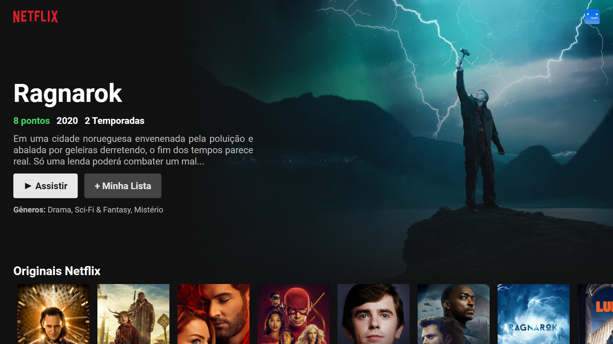

<h1 align="center">
  <a href="https://github.com/PitzTech/netflix-react-clone"></a>
</h1>

<blockquote align="center">“Sucesso não é o resultado de um jogo, mas o destino de uma jornada”!</blockquote>

<p align="center">
  <a href="#-tecnologias">Tecnologias</a>&nbsp;&nbsp;&nbsp;|&nbsp;&nbsp;&nbsp;
  <a href="#-projeto">Projeto</a>&nbsp;&nbsp;&nbsp;|&nbsp;&nbsp;&nbsp;
  <a href="#-como-usar">Como usar</a>&nbsp;&nbsp;&nbsp;|&nbsp;&nbsp;&nbsp;
  <a href="#memo-licença">Licença</a>
</p>

<p align="center">
 

  
</p>

<br>

<p align="center">
   
</p>

<h3 align="center">
   Um clone da interface da Netflix construido com ReactJS, Typescript, Styled Components e TMDB API.
</h3>

## 🚀 Tecnologias

Esse projeto foi desenvolvido com as seguintes tecnologias:

-  HTML
-  CSS
-  Typescript
-  ReactJS
-  Axios
-  Styled Components
-  TMDB API

## 💻 Projeto

Esse projeto foi desenvolvido visando replicar a interface de um serviço de streaming, no caso o Netflix, para exercitar o desenvolvimento baseado em ReactJS e Typescript.

## 👷 Como usar

<p>Você irá precisar dessas instalar essas ferramentas:</p>

-  [Node.js](https://nodejs.org/en/ "Node.js")
-  [Yarn](https://yarnpkg.com/ "Yarn")
-  [Git](https://git-scm.com/ "Git")

Para executar basta rodar os seguintes comandos:

```bash
# Clone this repository
$ git clone https://github.com/PitzTech/netflix-react-clone

# Go into the folder of the project
$ cd netflix-react-clone

# Install the dependencies
$ yarn

# Start the client
$ yarn start

```

## :memo: Licença

Esse projeto está sob a licença MIT. Veja o arquivo [LICENSE](LICENSE.md) para mais detalhes.

---

Projeto concluido com ♥ by PitzTech:wave:

<p align="center">
  <a href="https://www.linkedin.com/in/victor-laurentino-do-nascimento/"></a>
  &nbsp;&nbsp;&nbsp;&nbsp;
  <a href="mailto:victorlaurentino7@gmail.com?subject=Oi%20Victor!%20Vim%20do%20seu%20GitHub"></a>
  &nbsp;&nbsp;&nbsp;&nbsp;
  <a href="https://www.linkedin.com/in/victor-laurentino-do-nascimento/"></a>
</p>
